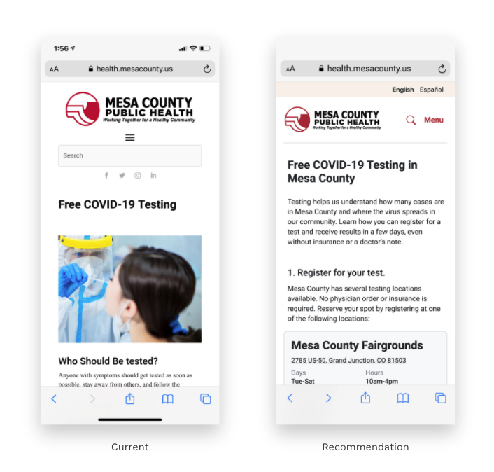

# Content Strategy

To organized content with information scent, we:

* **Prioritized most important** information in top button such as Vaccine sign-up instead of Data Dashboard
* **Provided secondary links** to important pages \(testing, reopening\)
* **Separated resources or links** to other authorities \(e.g. CDC\) to prevent overwhelming users with content

* **Set a clear hierarchy** of user goals by setting apart vaccine scheduling even more with clear steps to guide their decision-making process

* **Reorganize content** to give users information, rather than direct them to it \(i.e. with a “Q&A” format\)

* **Minimize scrolling** by redesigning key design elements, so users can get information quickly

