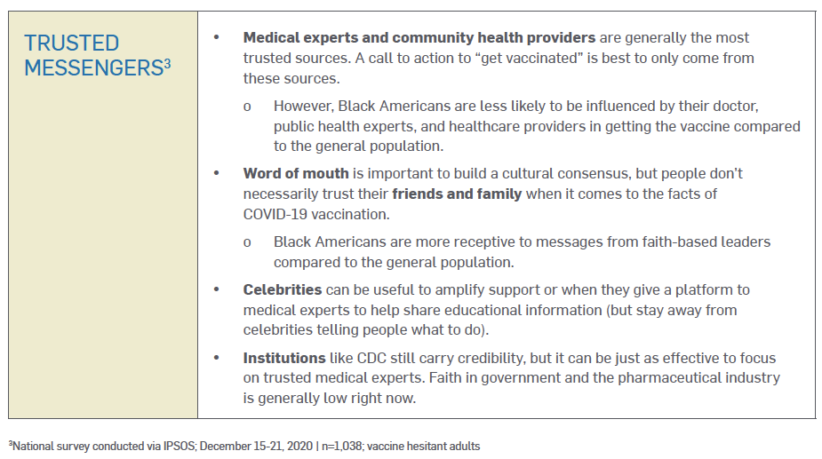
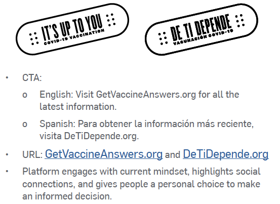

# Messaging Examples and Templates

Below are examples and creative guidance to build confidence and trust with BIPOC communities, based on extensive qualitative and quantitative research from the Ad Council, including cross-cultural focus groups, to uncover the most impactful messaging frameworks.

Check out the microsite developed by Georgia Tech’s Center for Inclusive Design and Innovation with funding from CDC Foundation and technical assistance from CDC. It makes [**COVID-19 messaging available to people with disabilities**](http://apha.informz.net/z/cjUucD9taT0zMjU5MTU3JnA9MSZ1PTM4MzU1MzYzNCZsaT0yODU2NzMyNw/index.html).

### MakeSpace: Make your Own Campaign and Resident Persona



### University of Minnesota Vaccine Central: Faith-based Organizations, Mobile Vans, Equity Pop-up Clinics, and Trusted Messengers



### COVID-19 Public Education Campaign



### Multilingual Vaccination Campaign Communications



### Messaging for Refugees, Immigrants, and Migrants



### Minnesota Be a Vaccine Advocate: COVID-19 Vaccine Toolkit for Individuals and Organizations



### COVID-19 Messaging for People with Disabilities



### Creative Brief for **Black** Audiences



### Creative Brief for **Hispanic** Audiences













### Creative Brief for General Audiences



### **NLGJA** Stylebook for LGBTQ Language



