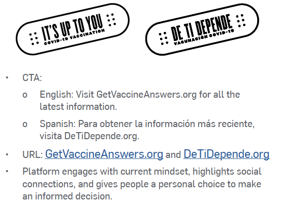

# Messaging Examples

Below are examples and creative guidance to build confidence and trust with BIPOC communities, based on extensive qualitative and quantitative research from the Ad Council, including cross-cultural focus groups, to uncover the most impactful messaging frameworks.

### Creative Brief for **Black** Audiences



### Creative Brief for **Hispanic** Audiences



### Creative Brief for General Audiences



### **NLGJA** Stylebook for LGBTQ Language



