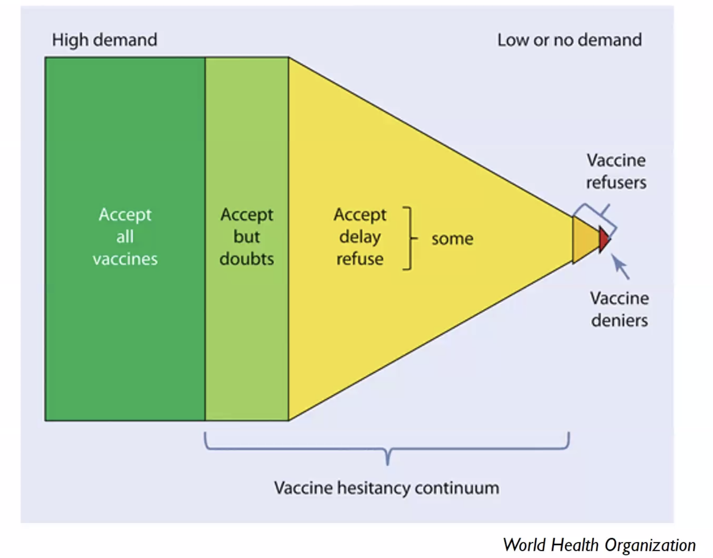
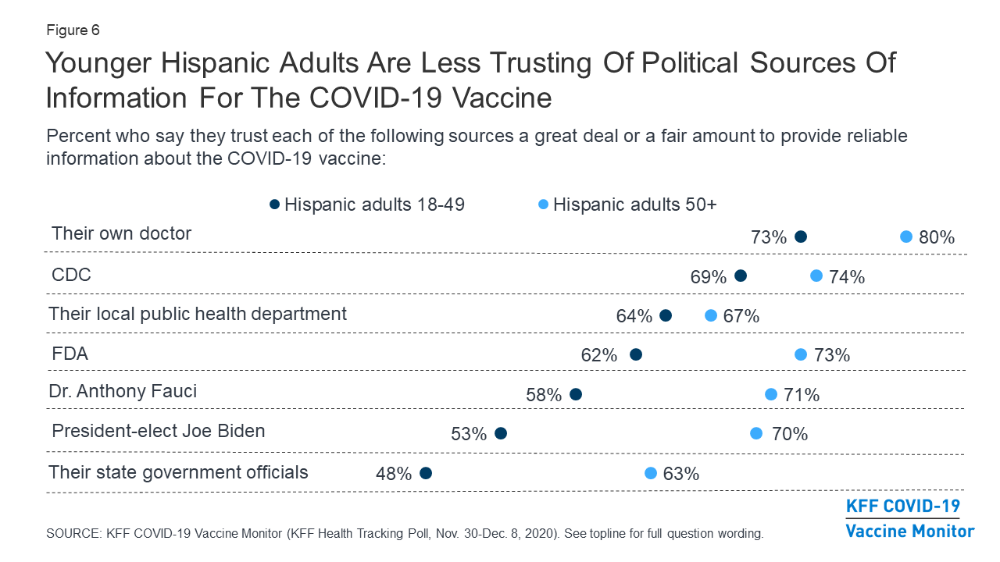

# Vaccine Hesitancy


**Relationships and Networks:** Social networks can also affect the degree to which individuals accept, question, or refuse vaccination. For instance, recent research on COVID-19 vaccine hesitancy indicates that adults in Black and Latino communities are _less_ _likely_ to know someone or personally have received at least one dose of the vaccine but are the most likely to want to see how the vaccine is working for other people they know \(Hamel et al., 2021\).

The degree to which individuals are nudged towards vaccination uptake can be influenced again by those they are most frequently connected.


**Vaccine hesitancy can be thought of as a continuum**. It can range from indecision, uncertainty, delay, and then, at most severe - reluctance \(SAGE Working Group, 2014\). Each of these forms of hesitancies can be influenced by several factors. 

**These are referred to as the 5 A’s:** Access, Affordability, Awareness, Acceptance, Activation \(Thomson et al., 2016\) or the **3 C's of vaccine hesitancy**: convenience, confidence, and complacency. When applying the health equity framework principles, the 5A taxonomy can help guide your vaccine campaigns’ communication and collateral strategy.

### Communication Tactics for Vaccine Confidence

**1.Moderate your organization's social media** and marketing platforms by assigning a community manager to engage with residents apply the SWIFT Method \(Caulfield, 2020\) to respond to vaccine misinformation:

* **Stop**: when you encounter potential misinformation. Even deciding not to share the content is a success metric
* **Investigate the source:** who is sharing the information? Is this from a reputable source \(sometimes there's no source, or there is imposter content\)? Use Google to look up news sources
* **Find better coverage:** look up what other coverage is on the same topic/ event. Focus on trusted sources by fact-checking sites. Do reverse image searches for false context of connection
* **Trace claims, quotes, and media to the original context:** click through links to find the original source. 

**2. Provide and advertise** digital testimonials from within your community networks. When authentic testimonials are not available, use personas to create a compelling and relatable story. Public figures that are closer to the community \(non-governmental figures\) can also be a great voice to include around acceptance. 

**3.** **Create collateral** that includes the call-to-action to share the content within their networks. This can include, but is not limited to: social media \# campaigns, text campaigns, free giveaways that have common-day objects that spread awareness on how \(and where\) to get a vaccine \(e.g., refrigerator magnets\). Key here is widening the number of touchpoints with positive messaging around vaccine uptake.

**4. Avoid myth-busting.** Don’t give misinformation a platform. Lead with the fact above the fold on your digital platforms.

**5. Consider who is communicating health information in a family.** In many multilingual families, there may be mono-lingual & bilingual household members. As such, tailoring vaccine messaging towards relationships can be useful for messaging to come directly from those most impacted by a person’s place on the vaccine hesitancy continuum and transition them to vaccine acceptance. 

For instance, consider [Isabella](../what-we-know/resident-personas.md). In her case, health information was tailored to emphasize the benefit of getting vaccinated to protect her family members \(children, parents who might live with her\) may be an effective way to motivate healthy behavior.


**Individual Factors:** Acknowledge individual beliefs and attitudes towards the COVID-19 vaccine access in messaging. This is a great time to acknowledge misinformation about who has access to COVID-19 vaccines and local availability.


**6. Highlight convenience and experience-based information about vaccine services.** Appeal to beliefs that might delay vaccination due to perception of the inconvenience of place or time-spent. 

**7. Identify key concerns constituents in your area have about affordability.** Clarify those questions up-front in content.

**8. Clearly state the role services play in vaccine cost.** Whether insurance status will affect their situation. And whether reimbursement is required. 

### Vaccine Hesitancy among the Hispanic Community

### Vaccine Hesitancy among Black Communities



### Vaccine Hesitancy among Parents



### **Sources**

MacDonald, N. E., & SAGE Working Group on Vaccine Hesitancy. \(2015\). Vaccine hesitancy: Definition, scope and determinants. Vaccine, 33\(34\), 4161–4164. [https://doi.org/10.1016/j.vaccine.2015.04.036](https://doi.org/10.1016/j.vaccine.2015.04.036)

Rosselli, R., Martini, M., & Bragazzi, N. L. \(2016\). The old and the new: vaccine hesitancy in the era of the Web 2.0. Challenges and opportunities. Journal of Preventive Medicine and Hygiene, 57\(1\), E47-50.

SAGE Working Group. \(2014\). Report of the SAGE Working Group on Vaccine Hesitancy. World Health Organization. [https://www.who.int/immunization/sage/meetings/2014/october/SAGE\_working\_group\_revised\_report\_vaccine\_hesitancy.pdf?ua=1](https://www.who.int/immunization/sage/meetings/2014/october/SAGE_working_group_revised_report_vaccine_hesitancy.pdf?ua=1) 

Piltch-Loeb, R., & DiClemente, R. \(2020\). The Vaccine Uptake Continuum: Applying Social Science Theory to Shift Vaccine Hesitancy. Vaccines, 8\(1\), 76. [https://doi.org/10.3390/vaccines8010076](https://doi.org/10.3390/vaccines8010076)   
Thomson, A., Robinson, K., & Vallée-Tourangeaub, G. \(2016\). The 5As: A practical taxonomy for the determinants of vaccine uptake. Vaccine, 34\(8\), 1018–1024. https://doi.org/10.1016/j.vaccine.2015.11.065

