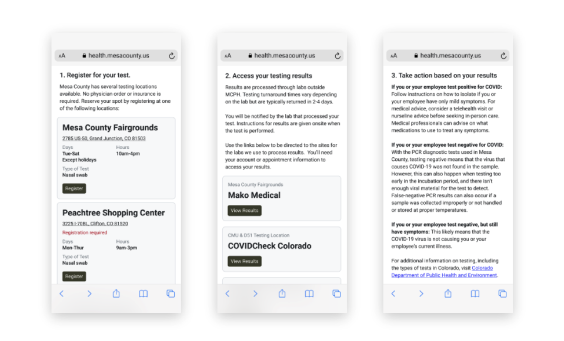
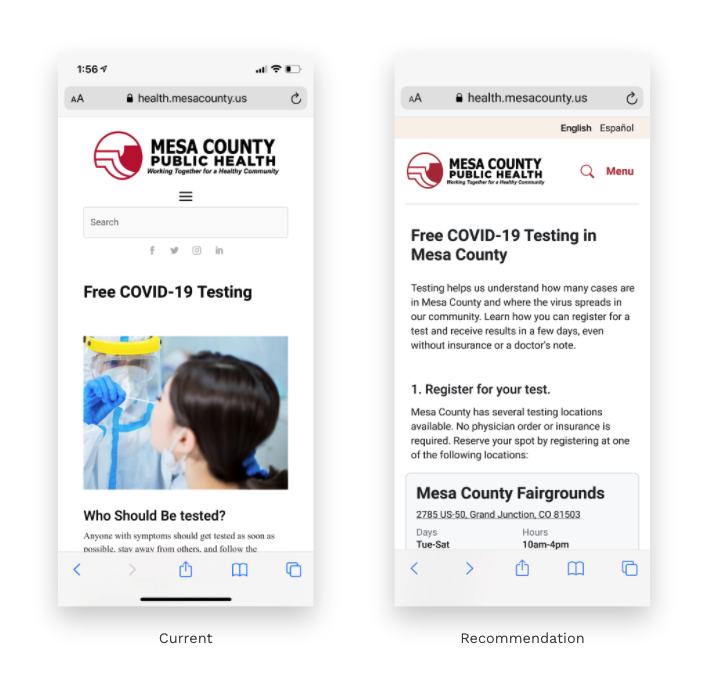

# Content Strategy

To empathize with our government partner's residents, we applied [role modeling strategy](https://headheartbrain.com/brain-savvy-business/role-models-making-role-modelling-an-effective-leadership-development-strategy/#:~:text=see%20them%20through.-,Essentially%20what%20we%20are%20doing%20in%20using%20a%20role%20modelling,others%20to%20identify%20with%20them) such as:

* **Prioritized most important** information in top button such as Vaccine sign-up instead of Data Dashboard
* **Provided secondary links** to important pages \(testing, reopening\)
* **Separated resources or links** to other authorities \(e.g. CDC\) to prevent overwhelming users with content

* **Set a clear hierarchy** of user goals by setting apart vaccine scheduling even more
* **Reorganize content** to give users information, rather than direct them to it \(i.e. with a “Q&A” format\)
* **Minimize scrolling** by redesigning key design elements, so users can get information quickly

