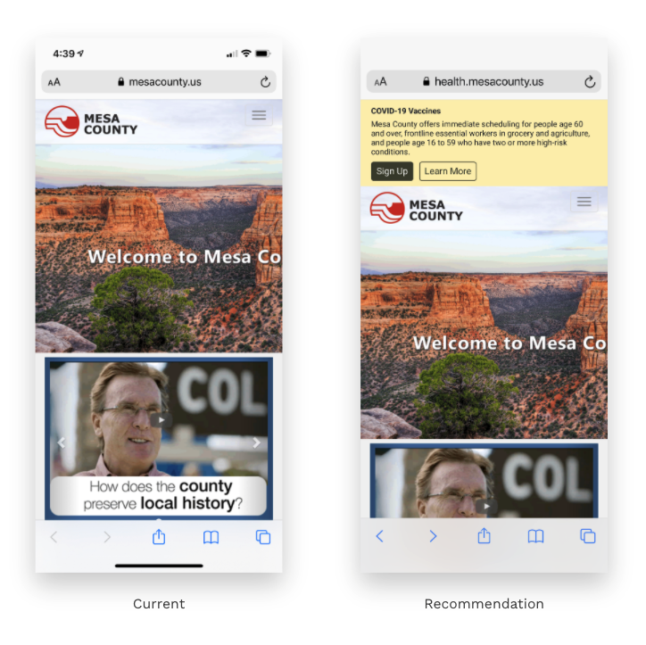

# Site Navigation

To reduce friction on homepages or any pages [above the fold](https://en.wikipedia.org/wiki/Above_the_fold) to learn about COVID-19 vaccines quickly, we added:

* **Temporary banner** to inform visitors of the most important action to take, specifically in signing up for a vaccine appointment and determining their phase eligibility
* **Sign-up primary call-to-action \(CTA\)** to nudge on the primary behavior for increasing the number of mobile and web visitor sign-ups for vaccination appointments
* **Learn more secondary CTA** to build trust and encourage visitors who have different behavioral motivations other than signing up for an appointment

