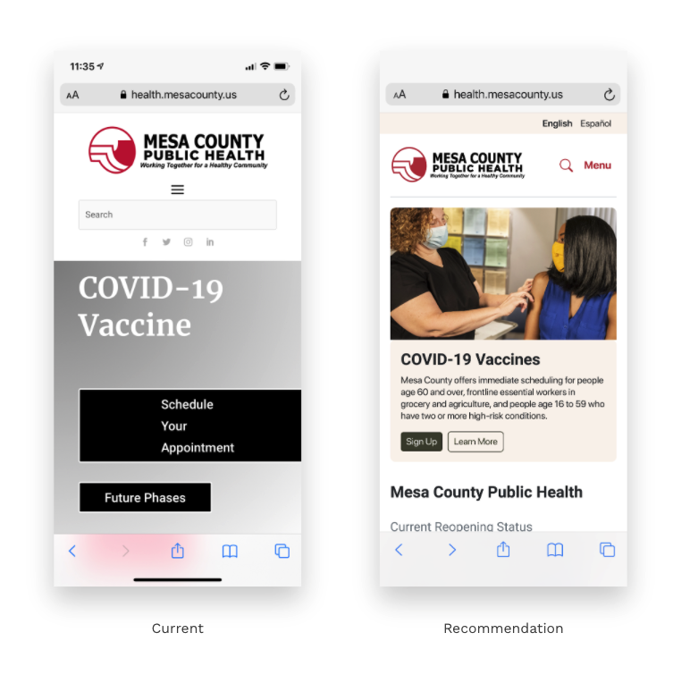
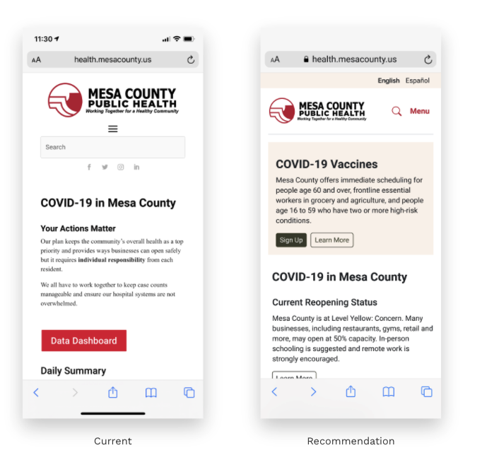
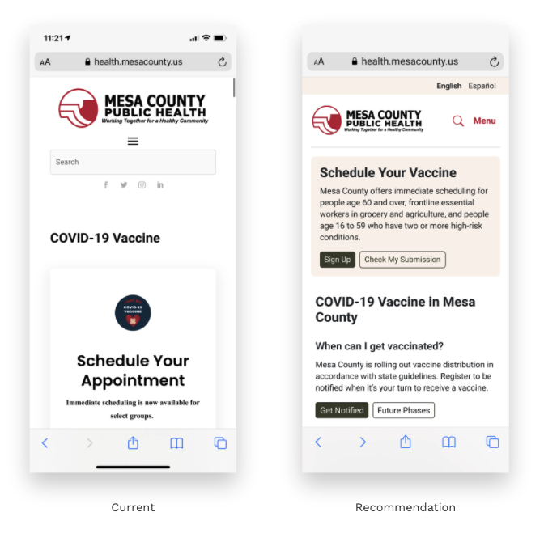
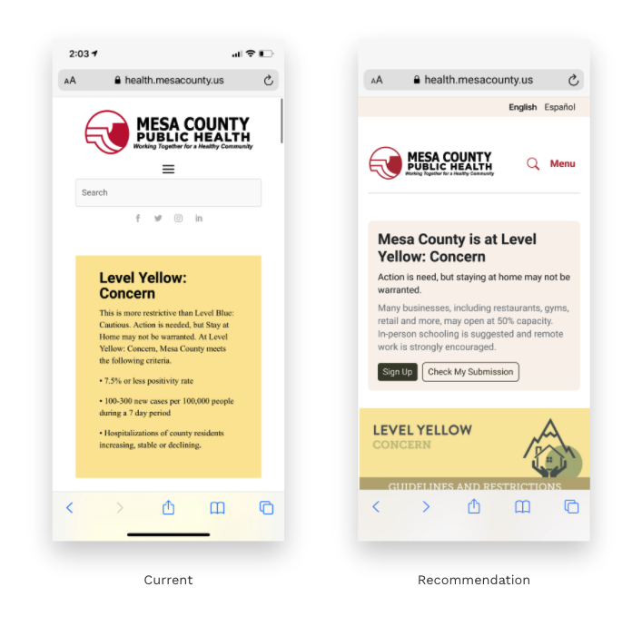
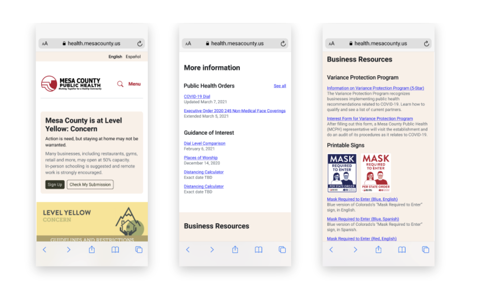

# Visual Design

To empathize with our government partner's residents, we applied [role modeling strategy](https://headheartbrain.com/brain-savvy-business/role-models-making-role-modelling-an-effective-leadership-development-strategy/#:~:text=see%20them%20through.-,Essentially%20what%20we%20are%20doing%20in%20using%20a%20role%20modelling,others%20to%20identify%20with%20them) such as:

**Images** that identify with the Hispanic community's values and cultural experiences

**Reusable cards** to highlight vaccine information with CTA to sign up

**Language preferences** to automatically translate a webpage into English or Spanish for improved literacy and outreach

**Color guides** to differentiate high risk or valuable information to a visitor with a call to action and tactical resources that are linkable or supported with a phone number to call to.

