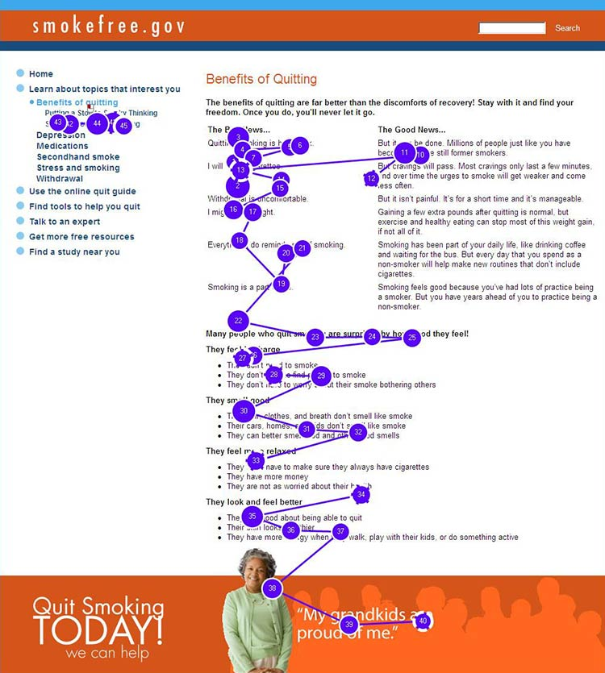

# Reading and Cognitive Challenges

We have identified common reading and cognitive challenges for the general public, based on existing research from trusted organizations, including health.gov. We account for the health equity principles, with a specific focus on [**Individual Factors**](../introduction/health-equity-framework-overview/individual-factors.md) ****and [**Physiological Pathways**](../introduction/health-equity-framework-overview/physiological-pathways.md) of people with disabilities, communities with low literacy skills, and people with cognitive and medical issues.

**Keep the following in mind**

* Users with **limited literacy skills** generally read more slowly, and reread words, sections, or elements on a website \(like buttons or menus\) in order to understand them.
* These users **skip words or sections** or start reading in the middle of a paragraph.
* When users are reading something very important, and they **feel the stakes are high**, they try to read every word, because they can’t effectively scan and draw meaning from content.
* Dense **“walls of words”** can trigger limited-literacy readers to skip content altogether.
* **For forms,** users need to read the instructions and the form field labels, and then either spell the answers to questions or read and select from multiple-choice answers. This is a lot to ask from users with limited literacy skills.

