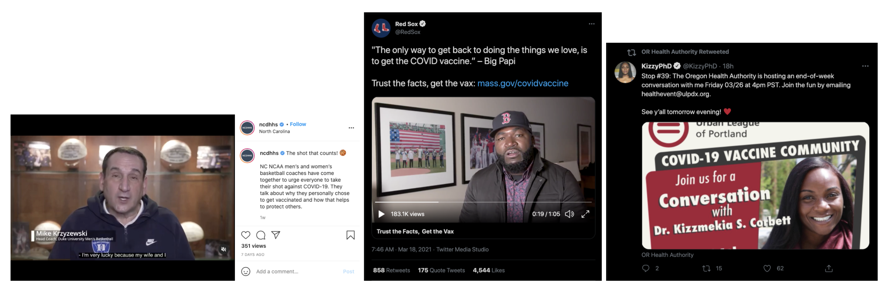
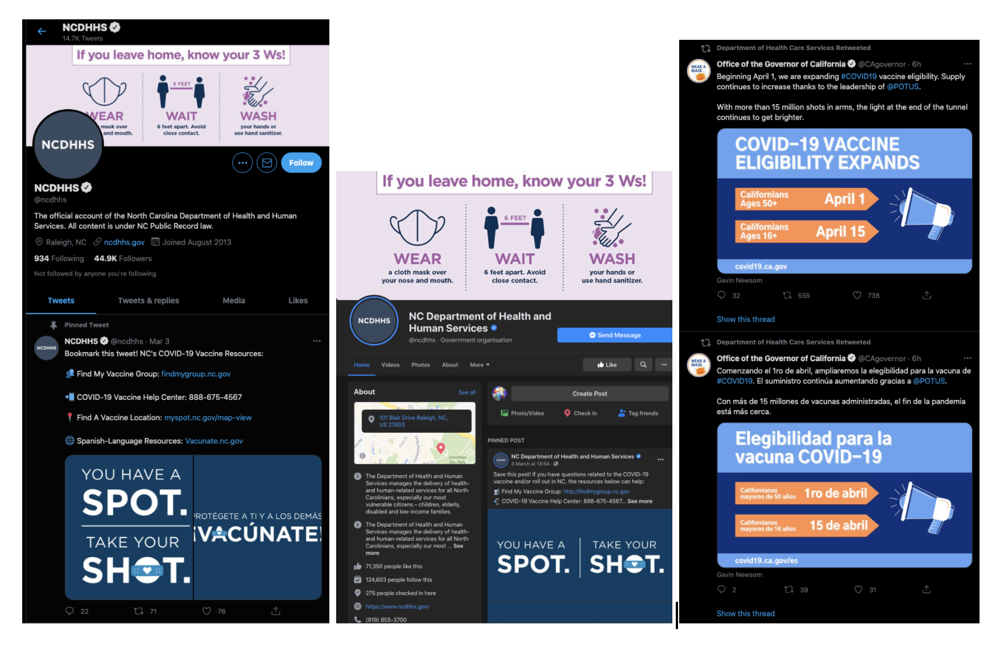
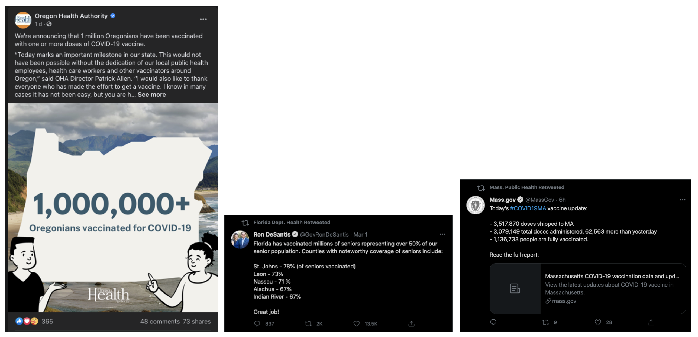
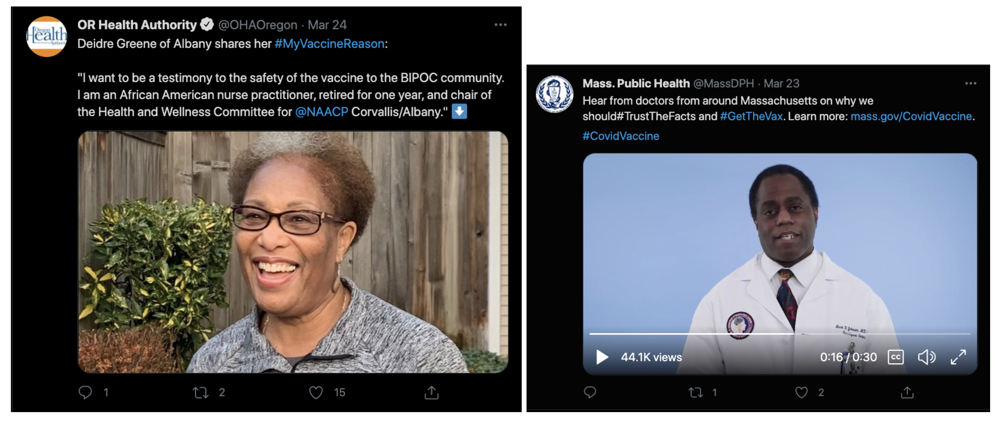
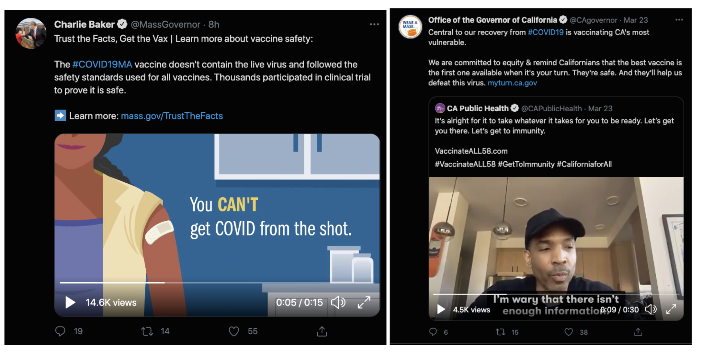
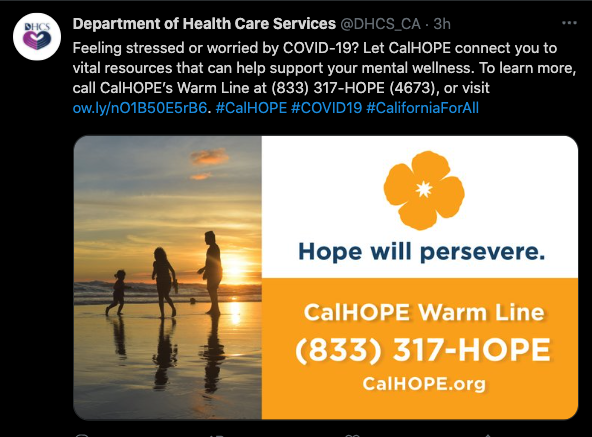
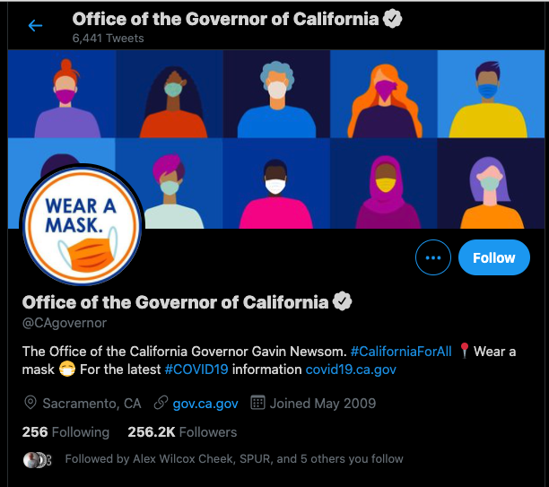
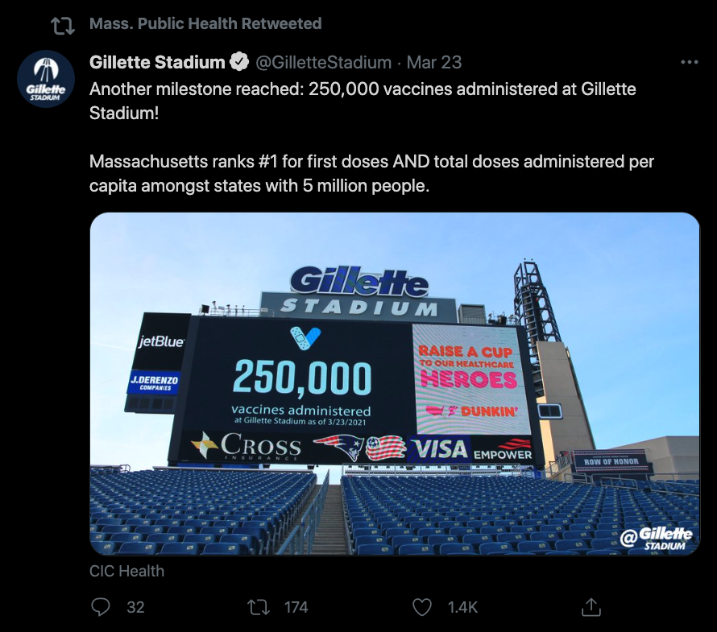

# Government Social Media Landscape

This is an analysis that synthesizes a survey of seven state governments’ social media: California, Florida, Massachusetts, New Jersey, New York, North Carolina, and Oregon. Attention was put towards content that was highly interacted with. [Full list of screenshots captured here](https://drive.google.com/drive/folders/1yTTCyLHeRXuUhTbrjDjcRU-r05OZzdyb?usp=sharing).

### **Key Themes and examples**

**Some governments are partnering with local organizations to create and circulate content.** When content is created in partnership, it’s shared first on the partner’s account and then re-circulated by the government’s account. There’s leveraging of state and local celebrities and medical professional heroes.

**There’s consistency across Twitter and Facebook and in content when it’s in more than one language.** When a state organization has a COVID-related banner image and pinned content on Twitter and Facebook they are visually grabbing and simple.

**A type of content that is common and highly interacted with is sharing vaccination milestones.** Many times, but not always, the message was first shared by a government official’s account, such as the Governor’s, and then circulated by a department.

**Governments are elevating BICOP medical professionals to share their personal and professional voices.** Amid disparities, Black doctors are [using TikTok and Instagram](https://www.latimes.com/california/story/2021-03-04/how-black-doctors-use-tiktok-to-instill-faith-in-the-vaccine) to foster restorative justice and encourage healthy behaviors such as getting the COVID-19 vaccine.

**Some governments are validating that there are vaccine worries and then addressing them.** The voice is empathetic and reassuring about the feelings and decisions their residents need to make.

**Acknowledging the impact of the pandemic** on mental wellness is a common theme and content type and provided an option for support in social media posts.

**Encouraging a staycation, a fun way to frame not traveling to support public health** is another example that shows care for residents.

**Messaging in physical contexts that some residents have fond memories** of is powerful and encourages them to look forward to going back to.

